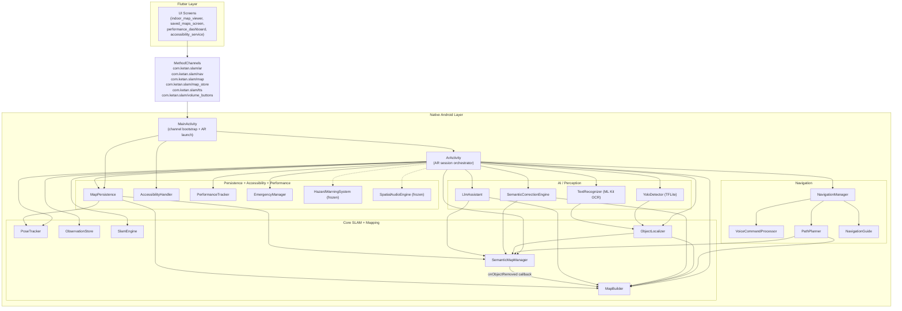

# Figure 3.3: Native Android Module Dependency Diagram

```mermaid
flowchart TB
  %% Flutter side
  subgraph F["Flutter Layer"]
    UI["UI Screens\n(indoor_map_viewer, saved_maps_screen,\nperformance_dashboard, accessibility_service)"]
  end

  MC["MethodChannels\ncom.ketan.slam/ar\ncom.ketan.slam/nav\ncom.ketan.slam/map\ncom.ketan.slam/map_store\ncom.ketan.slam/tts\ncom.ketan.slam/volume_buttons"]

  %% Android entry/orchestration
  subgraph A["Native Android Layer"]
    Main["MainActivity\n(channel bootstrap + AR launch)"]
    Ar["ArActivity\n(AR session orchestrator)"]

    subgraph Core["Core SLAM + Mapping"]
      Pose["PoseTracker"]
      Obs["ObservationStore"]
      MapB["MapBuilder"]
      Slam["SlamEngine"]
      ObjLoc["ObjectLocalizer"]
      SemMap["SemanticMapManager"]
    end

    subgraph AI["AI / Perception"]
      Yolo["YoloDetector (TFLite)"]
      Ocr["TextRecognizer (ML Kit OCR)"]
      SemCorr["SemanticCorrectionEngine"]
      Llm["LlmAssistant"]
    end

    subgraph Nav["Navigation"]
      NavMgr["NavigationManager"]
      Voice["VoiceCommandProcessor"]
      Planner["PathPlanner"]
      Guide["NavigationGuide"]
    end

    subgraph Support["Persistence + Accessibility + Performance"]
      Persist["MapPersistence"]
      Access["AccessibilityHandler"]
      Perf["PerformanceTracker"]
      Emerg["EmergencyManager"]
      Hazard["HazardWarningSystem (frozen)"]
      Audio["SpatialAudioEngine (frozen)"]
    end
  end

  %% Bridge flow
  UI --> MC --> Main
  Main --> Ar
  Main --> Persist
  Main --> Access

  %% ArActivity to modules
  Ar --> Pose
  Ar --> Obs
  Ar --> MapB
  Ar --> Slam
  Ar --> ObjLoc
  Ar --> SemMap
  Ar --> Yolo
  Ar --> Ocr
  Ar --> SemCorr
  Ar --> Llm
  Ar --> NavMgr
  Ar --> Persist
  Ar --> Perf
  Ar --> Emerg
  Ar -.-> Hazard
  Ar -.-> Audio

  %% Internal dependencies
  NavMgr --> Voice
  NavMgr --> Planner
  NavMgr --> Guide
  Planner --> MapB
  Planner --> SemMap

  Yolo --> ObjLoc
  Ocr --> ObjLoc
  ObjLoc --> SemMap
  ObjLoc --> MapB
  SemCorr --> MapB
  SemCorr --> SemMap
  Llm --> SemMap
  Llm --> MapB

  SemMap -->|onObjectRemoved callback| MapB
  Persist --> MapB
  Persist --> SemMap
  Persist --> Pose
```
